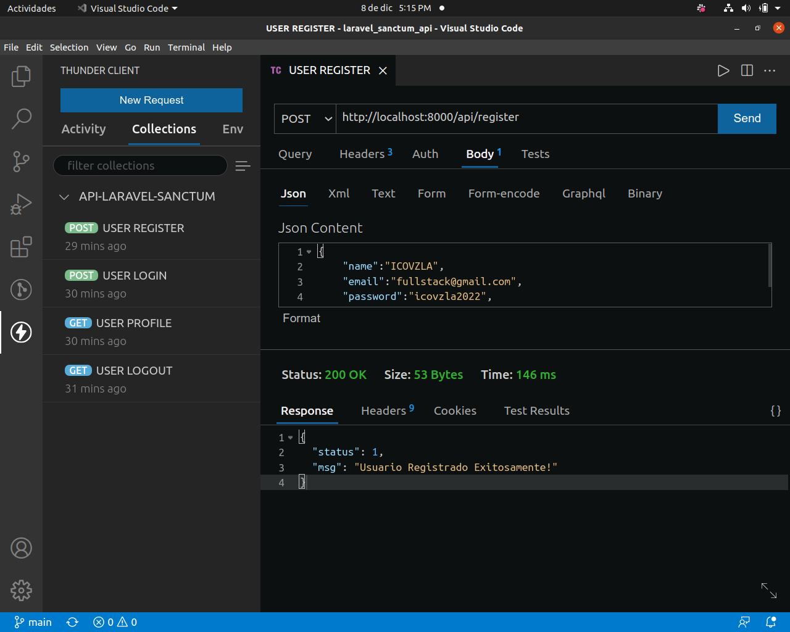
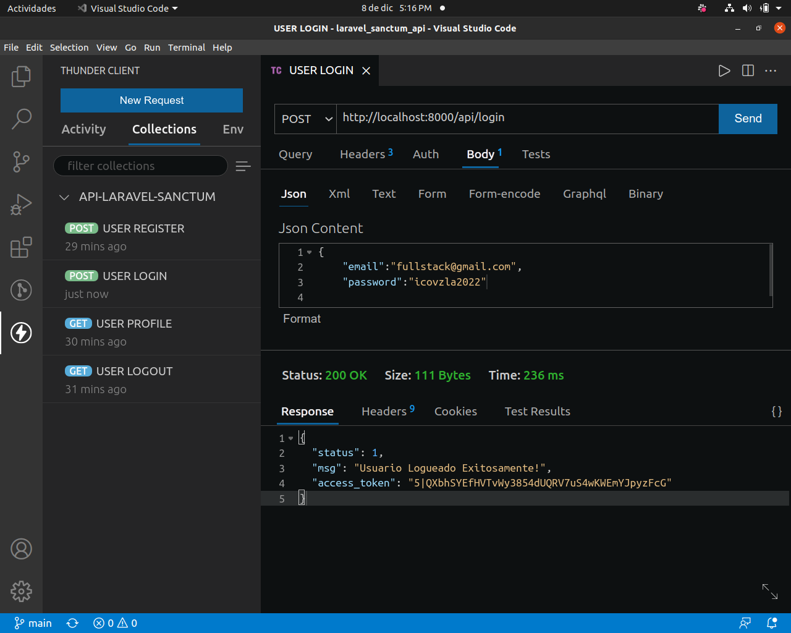
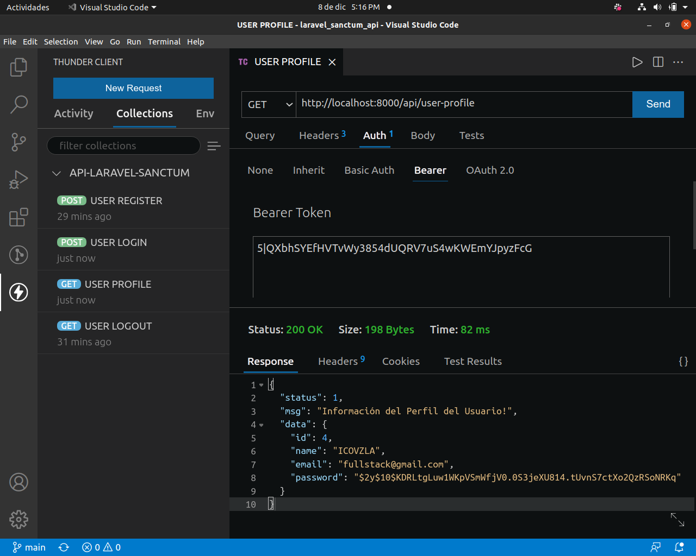
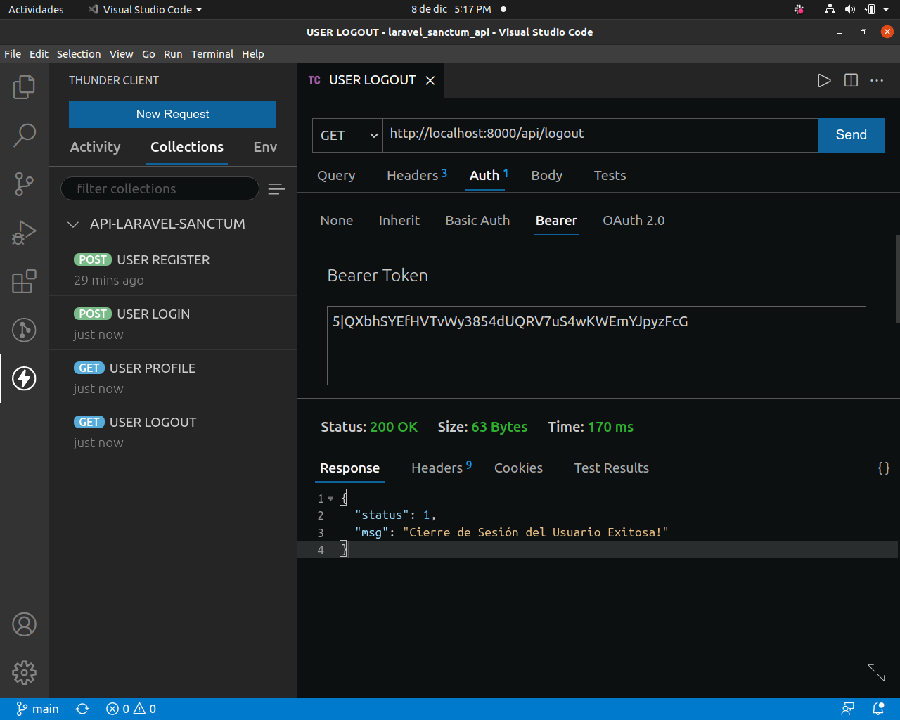

# Project Title

API PARA AUTENTICACIÓN DE USUARIOS LARAVEL-SANCTUM

# Project Description

API PARA AUTENTICACIÓN DE USUARIOS METODOS (register, login, user-profile, logout)

# Screenshot

## Getting Started

# The easiest way to get started is to clone the repository:

git clone https://github.com/ENDERSON-MARIN/LARAVEL-SANCTUM-API-AUTH

# Change directory

cd project_dir

# Then simply start your app

php artisan serve

you can check website will be up and running on localhost
http://localhost:8000/api/register
http://localhost:8000/api/login
http://localhost:8000/api/user-profile
http://localhost:8000/api/logout

### Prerequisites

you need to install following software

1.  WEB SERVER (PHP, APACHE)
2.  DATABASE MYSQL
3.  OTHER OPTIONS:
    laragon https://laragon.org/download/index.html
    OR
    xammp https://www.apachefriends.org/download.html
    OR
    wammp https://sourceforge.net/projects/wampserver/files/latest/download

## Author

-   [Enderson Marín](https://github.com/ENDERSON-MARIN)

## License

This project is licensed under the MIT License - see the [LICENSE.md](LICENSE.md) file for details

## Web Site:

-   https://www.marinenderson.com/
